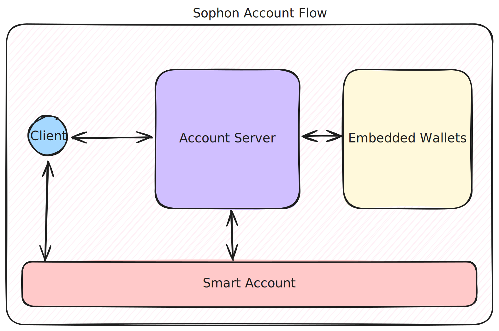

# Sophon Account Architecture

## General Overview

In general, we have some main components that work together to make the account work:

- Client SDKs
- Account Server
- Embedded Wallets
- Smart Account

### Smart Account

The most important part of the entire flow is the Account Abstraction, this means that we will deploy a smart contract for you that is compatible with some industry standards, like [EIP-7579](https://eips.ethereum.org/EIPS/eip-7579) and [EIP-4337](https://eips.ethereum.org/EIPS/eip-4337). This have direct impact on how you use your wallet and the features available.

The most important feature is that instead of having a classic EOA, you have total control over a smart contract, and there are multiple possible modules that are/will be available to use, some examples:

- account recovery
- passkey support
- sessions
- custom integrations
- etc...

All of this will be controlable only by you, only you can authorize transactions and signatures as well as module operations, like adding passkey support.

### Embedded Wallets

Alongside with classic EOAs, that you can use to interact with your Smart Account, we offer support to something known as Embedded Wallets, a mechanism that hides the wallet management complexity and don't force you to use known wallets providers like Metamask. This is tied to your email and/or social accounts.

This means that you can create a wallet by just authenticating with your google account and nobody besides your account has access to the private key. As it happens to classic EOAs, Embedded Wallets can be used to interact with your Smart Account.

### Account Server

The account server is a special component that serves as middleware between you and your Smart Wallet. It exists to make interacting with Web3 easier and remove barriers for new users that may not be power users of cripto natives.

The account server can be used in three different ways:

- You can access it directly to manage your profile, and in the future execute transactions like bridges or swaps
- You can use our SDK thats compatible with [EIP-6963](https://eips.ethereum.org/EIPS/eip-6963) that allows you to add Sophon Wallet as a valid wallet that your users can use to authenticate and use your system
- You can use our react native SDK to interact directly with the Account Server and have a great flow for the users, without having to switch between apps of installing extra ones

The Account Server exists to make the user's life easier. You obviously have total control over the smart account, you can always use your EOA, or export your private key and use it to interact directly with the smart contract.

### Client SDKs

Basically, this repository and e every helper SDKs to interact with the Sophon Account.

## Packages Overview

All the things discussed in the previous topic are organised in packages or apps in this repository. Here's a brief description on everything.

- `apps/account-server`: the core of the account server, the main component that works as a middleware between the client and the smart account as a facilitator for better user experience
- `apis/sophon-defi-api`: helper API for DeFi operations like Bridges ans Swaps
- `examples`: you will find development examples here, basically sandboxes to test new features before releases
- `packages/account-core`: core values and helpers that should be used by almost every package
- `packages/account-connector`: we export a wagmi connector to enable custom sites to use the Sophon Account, ideally you will use the standart EIP-6963 connector here, of use this package if you are using tome specific plataform
- `packages/account-eip6963`: this package has connectos that broadcast using the EIP-6963 for wallet discovery, this is the go to package if you are creating a Web app.
- `packages/account-message-bridge`: core functionalities holding communication mechanism between clients and the Account Server
- `packages/account-react`: hooks for react systems, mainly to be used on the account server, but could be used directly by other systems as well
- `packages/account-react-native`: the go to package if you are using react native and want to add Sophon Account support

You will find readmes on every package with more details on their purpose and how to use them.
